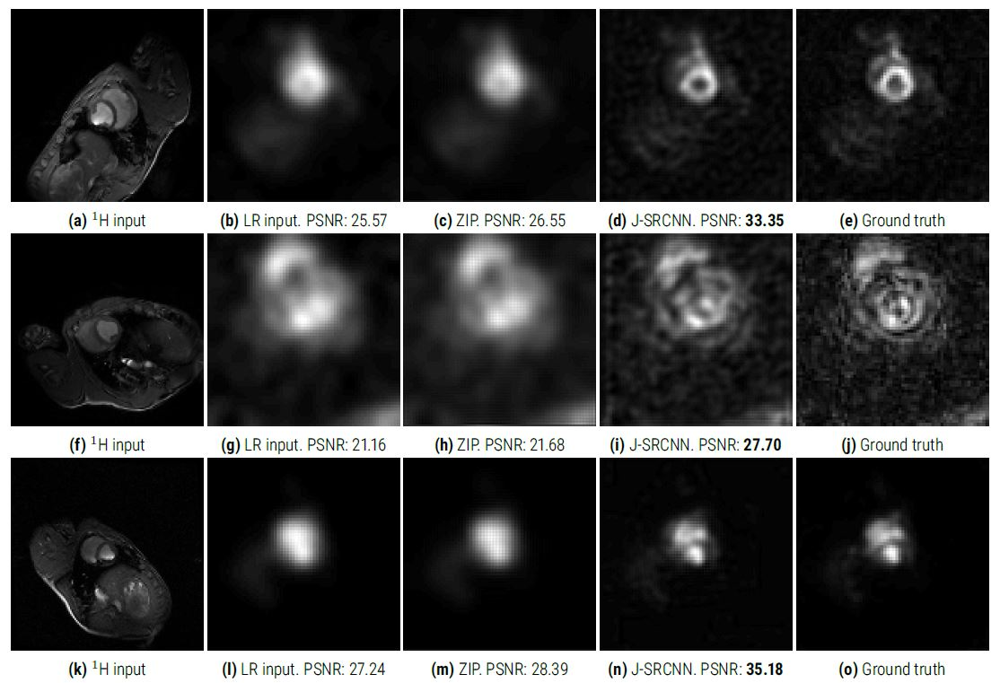

# Convolutional Neural Network for Super-Resolution Hyperpolarized MRI Images

## Problem statement
To design a convolutional neural network for super-resolution of 13-C images based on the external input from high resolution 1-H images.

## Contributions
The proposed models will be a transparent and generic representation of how a CNN can perform both single as well as joint super-resolution on desired images.

### Joint SRCNN Architecture
The J-SRCNN is comprised of three separate components. The input will be a 1-H and an 13-C image. The two images are processed separately, and the generated feature maps will be concatenated and processed in a similar
manner.

### Results
Evaluating the PSNR and loss with respect to epochs shows how the model performs with great stability as no fluctuations are seen on the figure. The fact that the test accuracy is greater than the training
accuracy indicates that the training of the model has not been sufficient. A larger amount of samples or the use of other cross-validation techniques could alleviate this problem.

The results are evaluated using PSNR as a metric of accuracy between the predicted image and the ground truth image and are compared to one of the golden standards, zero-filling interpolation, ZIP in terms of increasing the image resolution.

As seen on the previous figure, the J-SRCNN proves to enhance the resolution compared to ZIP. Comparing the low resolution 13-C images to the ZIP images, there are only an insignifficant difference in PSNR of 0.98, 0.52 and 1.15. It
is seen how a greater increase in PSNR is found, comparing the low resolution 13-C images to the J-SRCNN images with an additional increase of 6.80, 6.02 and 6.79.
The average PSNR for ZIP and the proposed J-SRCNN for all images are shown in table.

The average increase in PSNR indicates that a joint reconstruction can outperform the state-of-the-art method, ZIP. Furthermore it is proved to use information in one image to gain higher PSNR in its coupled
image. The model has learned a mapping between low resolution and high resolution images from using features extracted from an image of higher resolution. J-SRCNN has achieved excellent performance with an average increase in PSNR of 19.67% compared to the single-image SRCNN using 13C images only with an average increase in
PSNR of 8.80%.
